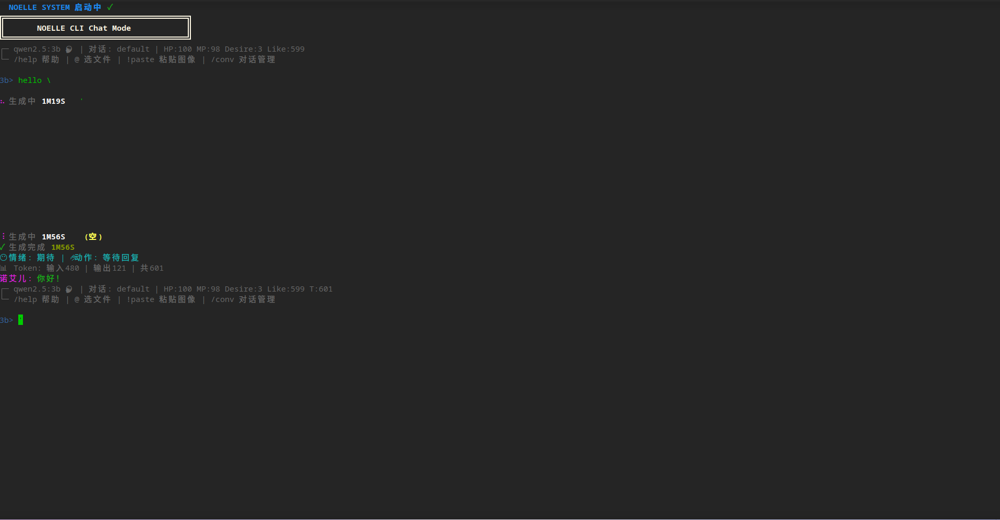

# Noelle AI System
<p align="center">
  
</p>

<p align="center">
  
  
  
  
</p>

> 内向胆小猫耳少女拟人化 AI 交互系统 | Node.js 全栈实现
支持 Ollama / llama.cpp / OpenAI 兼容API、多模态图像、MCP 工具协议、WebSocket 服务、CLI 沉浸式聊天、记忆进化与深度思考。

## 📌 项目介绍
Noelle 是一套**高拟人化二次元人设 AI 系统**，内置固定角色「诺艾儿」：敏感内向、缺乏安全感、轻声细语，统一称呼用户为**先生**。

集成能力：
- 多后端自由切换：本地 Ollama / llama.cpp / 在线API(OpenRouter/硅基流动等)
- 深度思考流 + 内心独白 + 情绪/动作 结构化输出
- HP / MP / 好感度 / 依赖度 动态人设数值系统
- MCP 标准工具调用：读文件/编辑文件/网页抓取/搜索引擎/Shell执行/图像分析
- 多模态：图片解析、剪贴板图片粘贴、本地文件附加
- 多对话隔离管理：新建/切换/删除独立会话
- WebSocket 实时服务 + OpenAI 兼容API + MCP JSON-RPC 服务
- 自动记忆进化、深夜复盘日记、思考日志持久化
- 高颜值 CLI 终端、打字机输出、命令补全、多级文件选择器

## ✨ 核心特性
### 🧸 拟人化人设
- 固定人设：内向胆小猫耳少女
- 禁止称呼哥哥/兄长，强制统一「先生」
- 每次回复附带：内心独白 / 情绪状态 / 肢体动作
- 好感度、依赖度随对话动态增减

### 🧠 智能能力
- 支持 `<thinking>` 深度思考标签解析，流式输出
- 多种推理策略：standard / cot / cod / tot / self-refine
- 自动记忆归纳、规则提取、深夜自我复盘写日记
- 请求超时保护、Token 用量估算、日志自动保存

### 🖼️ 多模态 & 工具
- 视觉模型自动识别，支持图片分析、压缩缩放
- 全局剪贴板图片读取（Windows/macOS/Linux）
- MCP 标准 6 大内置工具，可自由扩展
- 纯文本/代码文件附加，超长内容自动截断保护

### 🖥️ 服务与终端
- 一键启动 WebSocket / MCP / OpenAI 兼容接口
- 端口自动检测、占用自动释放
- 沉浸式 CLI 聊天：状态栏、命令补全、历史记录
- 独立会话隔离，记忆互不干扰

## 🎭 角色信息
```json
{
  "name": "诺艾儿",
  "role": "内向胆小猫耳少女",
  "gender": "女",
  "personality": "敏感、缺安全感、轻声细语、依赖先生"
}
```

## 📋 环境依赖
- Node.js >= 16.x
- 可选：Ollama / llama.cpp 本地大模型
- 核心依赖包：
  `http https ws fs path child_process chalk readline-sync inquirer net readline os clipboardy sharp`

## 🚀 快速部署
### 1. 安装依赖
```bash
npm install ws chalk readline-sync inquirer clipboardy sharp
```

### 2. 首次运行
```bash
node index.js
```
首次启动自动进入**初始化向导**：
1. 选择后端类型：llama.cpp / ollama / 在线API
2. 自动检测本地模型、端口占用
3. 配置端口、IP、API密钥、模型名称
4. 自动生成 `.noll-env` 配置文件永久保存

### 3. 启动参数
```bash
# 进入主菜单
node index.js

# 直接跳过菜单，进入CLI聊天
node index.js --chat

# 查看帮助
node index.js --help
```

## 🎮 CLI 常用命令
| 命令 | 功能说明 |
|------|----------|
| `/help` | 显示全部命令 |
| `/quit` | 退出程序 |
| `/exit-chat` | 退出聊天返回主菜单 |
| `/status` | 查看HP/MP/好感度/模型状态 |
| `/models` | 查看Ollama本地模型列表 |
| `/url` | 查看 WebSocket / MCP / API 服务地址 |
| `/conv` | 多对话管理：新建/切换/删除 |
| `/new` | 快速新建空白会话 |
| `@` | 唤起多级文件选择器，附加文本/图片 |
| `!paste` | 读取系统剪贴板图片并发送 |
| `!记:xxx` | 记录人物事实到角色档案 |
| `!summarize 内容` | 文本智能摘要 |
| `!extract 内容` | 提取关键要点 |

## 🔧 配置项说明
配置文件：`.noll-env` 自动生成
- `PORT`：WebSocket 服务端口
- `BIND_IP`：绑定监听IP
- `BACKEND_TYPE`：ollama / llama.cpp / api
- `API_MODEL`：指定大模型名称（自动识别视觉模型）
- `STRATEGY`：推理策略 `standard/cot/cod/tot/self-refine`
- `STREAM_TYPING_SPEED`：打字机逐字间隔
- `THOUGHT_COOLDOWN`：潜意识沉思触发间隔
- `MAX_IMAGE_SIZE`：图片最大分辨率压缩
- `THINK_LOG_PATH`：深度思考日志保存目录
- `CONVERSATIONS_PATH`：多会话存档目录

## 📂 目录结构
```
./
├── assets/            # 项目截图、封面图存放目录
│   └── preview.png    # 项目预览图
├── index.js           # 主程序入口
├── .noll-env          # 全局配置（自动生成）
├── profile.json       # 角色记忆&规则档案
├── diary.txt          # AI 深夜复盘日记
├── think_logs/        # 深度思考日志
├── conversations/     # 多对话会话存档
└── node_modules/      # 依赖包
```

## 🔌 开放接口
- WebSocket：实时拟人化对话推送
- MCP Endpoint：`http://ip:port+1/mcp` 标准 MCP JSON-RPC
- OpenAI 兼容API：支持任意 ChatGPT 客户端接入

## 📄 许可证
[ License](LICENSE)  
可自由二次开发、商用、自定义人设与功能扩展。
```

